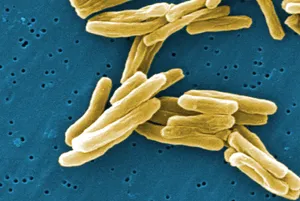

# Bacteria Basics

> Figure 1, Electron Microscope Image of a bacilli bacteria
## Bacteria
### Definition
Bacterium (Plural: Bacteria) is a single-cell prokaryotic organism. They always live in clusters and survive in very specific conditions. Let's take a look at the key features of Bacteria.

:::warning[Archaea have the same definition!!!]
Yes you are right! The main difference between archaea and bacteria is the presence of a peptidoglycan cell wall. Archaea DO NOT have a peptidoglycan cell wall. 
:::
### Key Features
- Each bacterium consists of one single cell only
- Bacteria are prokaryotic cells, which means there are no nuclear membrane. 
- Bacteria cell walls are made of peptidoglycan
- Bacteria reproduce asexually by binary fission (more on that in another chapter)
- Very important in ecosystems

## Citations
https://my.clevelandclinic.org/health/articles/24494-bacteria
https://www.britannica.com/science/bacteria/Growth-of-bacterial-populations
https://www.britannica.com/science/bacteria
