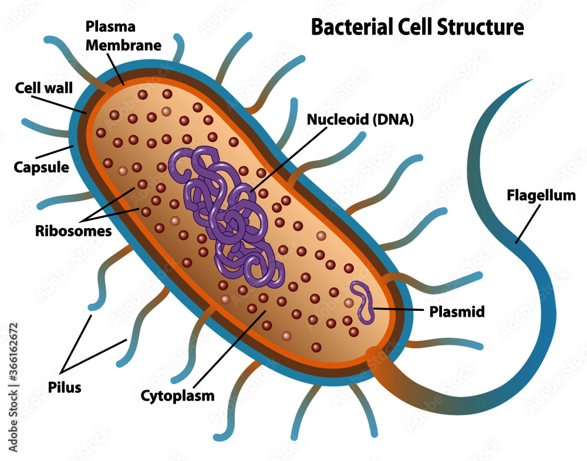

# Bacteria Structure

## Introduction
To fight Novato, which is a bacteria, we need to first understand the fundemental structure of bacteria. Let's take a look at the following diagram about a typical bacteria structure (Adobe Stock, n.d.): 

>  Figure 1, Bacteria Cell Structure Diagram

There are 9 main structures in a typical bacteria.

## The Structures
### Flagellum
The flagship feature of a bacterium: the flagellum. It is the "tail" part of a bacteria, which acts as a locomotion organelle. The flagellum provides forward momentum for the bacteria's movement by attaching to the end of the bacteria with a molecular motor.

Just like an electrical motor, the molecular motor yield rotation, rotating the flagellum to propel the bacteria forward. The motor is made of proteins and nucleic acids arranged regularly. 

:::info[NOTE]
Not all bacteria have a tail. Most tail-less bacteria are cocci bacteria. 
:::

### Pilus
Pilus are hair-like protein structures, functioning similarly like octopus legs. They extend beyond the cell surface, but has roots in the inner cell membrane (plasma membrane).

They are used for sticking to surfaces and specific cells, to keep the bacteria from being washed away. In addition, pilus are also used for keeping of bacteriaphages.

:::note
Bacteriaphages are viruses targeted at bacteria. They look like sci-fi movie spiders.
:::

### Plasmid
Plasmids are double-stranded circular DNA molecules that carry genetic information for copying chromosomes and creating anti-biotic resistance. They are not regular chromosomes found in the nucleus. 
### Cytoplasm
Cytoplasm are gel-like structures used as a filler and working site for the bacteria. It fills all the unoccupied spaces of the bacteria.

The working site is mainly used for metabolism and DNA replication.

### DNA (Nucleoid)
DNA or Deoxyribonucleic acid are double-stranded DNA molecules that carry genetic material for constructing the bacteria. 

:::note
DNA are long curled up strands while Plasmids are circular strands. 
:::

### Cell Wall
Bacteria cell wall is made of a special substance called peptidoglycan. Peptidoglycan is a kind of polysaccharide, which is made up of two other glucose substance: N-acetylglucosamine (NAG) and N-acetylmuramic acid (NAM). Each peptidoglycan is arranged in a long chain across the entire bacteria surface. 

There are two types of cell wall
1. Gram-Positive
2. Gram-Negative

Gram-Positive bacteria's cell wall are arranged on top of an inner membrane, without an outer membrane. 

Gram-Negative bacteria's cell wall are arranged on top of an inner membrane, but with an additional layer of outer membrane called lipopolysaccharide (LPS). Though the peptidoglycan layers are usually thinner in gram-negative bacteria. 

More about gram-positive and gram-negative in the next next chapter.

### Ribosomes
Ribosomes are "factories" made of ribosomal RNA proteins, for protein synthesis. It is a process that links messenger RNA (mRNA) in a specific order, and produce polypeptide chains, which then folds into proteins for specific usage. 

For example, peptidoglycan, the cell wall substance, are made using the ribosomes!

### Capsule
The capsule is a suspension layer used for protecting and absorbing nutrients for the cell. It is made of polysaccharides, polymers of simple sugars.

The capsule is hydrophilic or water loving, which helps the bacteria avoid dehydration by preventing water loss and absorbing water. 

### Cell membrane
Cell membrane or plasma membrane are used for regulating substance movement in and out of the cell. This include waste excretion, respiration, photosynthesis, and nutrient acquisition. 

Gram-positive bacteria have an inner membrane but no outer membrane.

Gram-negative bacteria have an inner membrane and an outer membrane. 
## Citations
Citations: [ScienceDirect](https://www.sciencedirect.com/topics/medicine-and-dentistry/pilus), [Britannica](https://www.britannica.com/science/flagellum), [Britannica](https://www.britannica.com/science/bacteria/Physical-requirements), [Byjus](https://byjus.com/biology/bacteria/), [Oregon State University](https://open.oregonstate.education/generalmicrobiology/chapter/bacteria-cell-walls/), [Britannica](https://www.britannica.com/science/bacteria/Capsules-and-slime-layers)